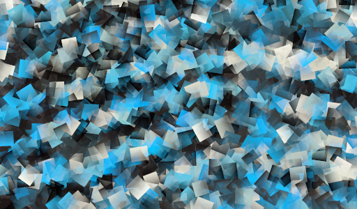

# Photo Farm



A photo viewer written in Rust that lets you quickly choose photos from a large collection.
It was designed specifically to work with SLR-type photo collections where the user needs to chose between a large selection of similar images.

Cross platform - Windows, Linux, MacOS


## How to use it

The best way to use this application is to associate JPG images with this executable. Right click image and choose "Open With" and select this executable. Set as default. 
Press `F1` for help on shortcut keys.

## How it works

Opening a JPG will result in this application creating a `thumbnails.db` sqlite3 database in the same folder as the jpeg image. 
A background task will then read all jpg images in the same folder and create high quality full-screen versions of these images to be stored in this database. 
This allows the user to very quickly browse all photos using the arrow keys in their keyboard.

The viewer is designed to cache high quality full screen images of much larger source images. 
There are some helper shortcut keys to help the user choose the best images. 
The idea being that you can flip back and forth between images quickly to choose the best one and zoom in (Left CTRL) to 1:1 resolution to see if the image is sharp or not. 
Marked photos can be copied to another folder for further processing by your favourite image editor

Exporting starred images copies jpegs as well as any file with the same name as the jpeg to an `export` folder in the current folder. 
Therefore if the user has RAW (e.g. .CR2) files these will be copied as well. This app will never delete files so it is up to you to clear your `export` folder if you change you un-star previously exported images.

## Non-goals

This photo viewer is not meant to edit photos, only to select and organise them.

## Building and running locally

```
cargo run --release -- /path/to/photos/IMG_0766.JPG
```